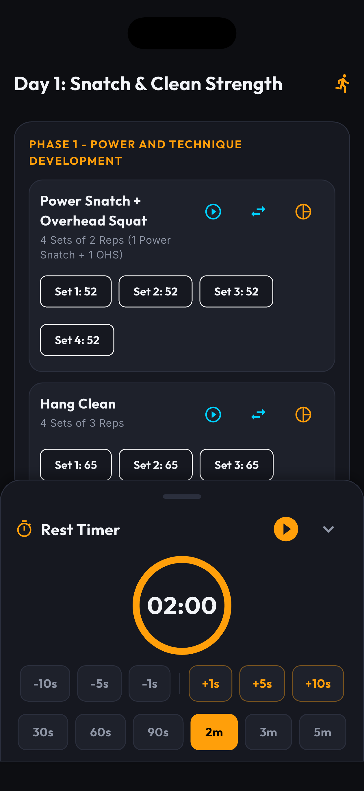
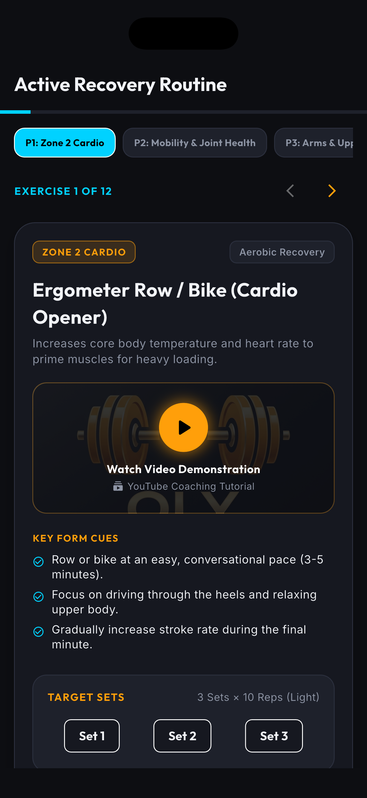

# OLY — Olympic Weightlifting & Periodization Tracker

<p align="center">
  
</p>

<p align="center">
  <b>A modern, high-contrast Flutter application designed for Olympic weightlifting athletes, coaches, and strength enthusiasts.</b>
</p>

<p align="center">
  
  
  
  
  
</p>

---

## 🌟 Overview

**OLY** is engineered specifically for the demands of Olympic weightlifting (Snatch, Clean & Jerk, and Squats). It integrates dynamic 4-Day and 5-Day periodization programming, real-time working percentage calculation (`65% → 70% → 75% → 70% → Retest`), movement video tutorials, an intelligent rest timer with lock-screen alerts, an IWF color-coded bumper plate calculator, Greg Everett / Catalyst Athletics 1RM variation ratios, an adaptive active recovery generator, and native data backup into a sleek, dark-mode mobile experience.

---

## 📱 Visual Feature Tour

| Home Dashboard | Live Workout Session |
| :---: | :---: |
|  |  |
| *Cycle periodization, workout selector, and quick recovery trigger* | *Set logging, exercise video demos, barbell loader popup, and rest timer* |

| Active Recovery & Mobility | Lift Catalog & 1RM Ratios |
| :---: | :---: |
|  |  |
| *12-drill mobility flow with video guides, form cues, and readiness score* | *1RM catalog, ratio balance analysis, and auto-calculated variation targets* |

| Barbell Plate Loader | Volume & Tonnage Analytics |
| :---: | :---: |
|  |  |
| *IWF color-coded bumper plates, fractionals, and barbell specs* | *Lifetime tonnage (Metric Tonnes / Short Tons), sets, reps, and workout logs* |

---

## 🚀 Comprehensive Feature Breakdown

### 🏋️‍♂️ 1. Structured Periodization Engine (4-Day & 5-Day Sequences)
- **Periodized Wave Loading**: Automatically calculates target weights for every working set based on your 1RMs and current cycle week:
  - **Week 1 (Base Loading)**: ~65% target intensity
  - **Week 2 (Loading)**: ~70% target intensity
  - **Week 3 (Peak Loading)**: ~75% target intensity
  - **Week 4 (Deload & Priming)**: ~70% reduced volume
  - **Week 5 (1RM Retest)**: Dedicated testing protocol with guided warmup ramps
- **Program Flexibility**: Toggle between **4-Day Strength & Technique** and **5-Day Classical Sequence** in Settings.
- **Preview & Exploration Mode**: Explore and review any past or future week/routine without modifying active cycle state or polluting analytics logs.

### ⏱️ 2. Live Workout Session Companion
- **Set & Rep Tracking**: Interactive set completion pills with real-time weight overrides and rep adjustments.
- **Movement Video Links**: Tap the video icon on any exercise card to instantly watch curated YouTube coaching tutorials for that exact movement.
- **Quick Plate Calculator**: Tap the barbell icon on any exercise card to calculate exact plate loading for that specific exercise target weight.
- **Exercise Substitution**: Easily swap accessories or primary movements on the fly using the built-in exercise catalog sheet.
- **Post-Workout Diagnostics**: Rate session RPE (1–10) and tag joint strain areas (e.g., Shoulders, Knees, Lower Back) upon completion to adapt your next recovery routine.

### ⏳ 3. Intelligent Rest Timer
- **Quick Presets**: Fast 30s, 60s, 90s, 2m, 3m, and 5m rest duration presets.
- **Micro-Adjustments**: Fine-tune timer on the fly with `-10s`, `-5s`, `-1s`, `+1s`, `+5s`, `+10s` step buttons.
- **Audio & Haptic Alerts**: Multi-stage audio beeps and vibration feedback upon timer expiration.
- **Lock-Screen Local Notifications**: Background notifications ensure you never miss rest expiration when your phone screen turns off or when switching apps.

### 🧘‍♂️ 4. Adaptive Active Recovery & Mobility Engine
- **Targeted Routine Generation**: 12 structured drills across 4 dedicated phases:
  - **Phase 1**: Zone 2 Aerobic Conditioning & Warmup
  - **Phase 2**: Mobility & Joint Health Flow (Thoracic extension, Hip openers, Ankle dorsiflexion)
  - **Phase 3**: Arms & Upper Body Hypertrophy
  - **Phase 4**: Core & Grip Strength (Hanging leg raises, Ab rollouts, Farmer carries)
- **Strain Adaptation**: Automatically prioritizes mobility drills targeting joints flagged during previous workout logs.
- **Daily Readiness Scoring**: Log 5-star readiness assessments to calibrate daily intensity.

### 💡 5. Catalyst Athletics Olympic 1RM Variation Ratios
- **Automated Ratio Ratios**: Built-in benchmark targets derived from Greg Everett Olympic standards:
  - **Hang Snatch**: 88% of Snatch
  - **Power Snatch**: 82% of Snatch
  - **Overhead Squat**: 110% of Snatch
  - **Hang Clean**: 88% of Clean & Jerk
  - **Power Clean**: 85% of Clean & Jerk
  - **Block Clean**: 90% of Clean & Jerk
  - **Front Squat**: 85% of Back Squat
  - **Push Press**: 75% of Clean & Jerk
- **One-Tap Suggestion Chips**: Auto-fill variation 1RMs calculated directly from your primary lifts.
- **Ratio Balance Diagnostic**: Identifies whether technique, pulling power, or leg strength is your limiting factor.

### ⚖️ 6. Visual IWF Barbell Bumper Plate Loader
- **Realistic Barbell Rendering**: Visually renders standard IWF colored bumper plates loaded on the sleeve:
  - 🔴 **25 kg / 45 lb** (Red)
  - 🔵 **20 kg / 35 lb** (Blue)
  - 🟡 **15 kg / 25 lb** (Yellow)
  - 🟢 **10 kg / 10 lb** (Green)
  - ⚪ **5 kg** (White Bumper)
  - ⚪ **Fractionals**: 2.5 kg, 2.0 kg, 1.5 kg, 1.0 kg, 0.5 kg
- **Customizable Equipment**: Switch between Men's 20kg bar, Women's 15kg bar, 10kg Technique bar, 45lb bar, and collar configurations (2.5kg competition collars or collarless).

### 📈 7. Lifetime Volume & Tonnage Analytics
- **Total Workload Calculation**: Multiplies `weight × reps` across all completed sets.
- **Metric & Imperial Support**: View total workload in **Metric Tonnes** ($1{,}000\text{ kg}$) or **US Short Tons** ($2{,}000\text{ lbs}$).
- **Historical Logs**: Comprehensive session breakdown with dates, RPE ratings, joint strain tags, and completed exercise sets.

### 💾 8. Native Backup, Export & Import
- **JSON Full Backup**: One-tap export and import of all user preferences, 1RMs, cycle history, and workout logs.
- **CSV Log Export**: Export human-readable spreadsheet-compatible workout logs for external analysis or coach review.

---

## ⚠️ Known Issues & Platform Considerations

### iOS Background Audio & Lock-Screen Notifications
- **Behavior**: On iOS, when the device is locked or the application is in the background, Apple's `AVAudioEngine` / `caulk` audio pipeline is placed into a suspended state by iOS CoreAudio. Attempting to trigger arbitrary in-app audio synthesizer playback during a resume race condition can lead to an iOS watchdog termination.
- **Implementation Design**: 
  - Rest timer expiration when the app is in the background is delivered reliably via native iOS `UNUserNotificationCenter` local notifications (`DarwinNotificationDetails` with system alert sound).
  - In-app audio player playback and tactile haptic sequences are reserved for active foreground use. If you return to the app after the timer has finished in the background, the UI updates gracefully without attempting an unsafe late audio playback.

---

## 🛠️ Architecture & Tech Stack

```
lib/
├── main.dart                      # Application root & multi-provider wiring
├── theme/
│   └── app_theme.dart             # Dark Obsidian (#121214) & Neon Amber (#FF9E1B) design system
├── models/
│   ├── lift_model.dart            # Lift definitions & Olympic variation ratio math
│   ├── program_model.dart         # 4-Day & 5-Day periodization templates & week loaders
│   ├── workout_session.dart       # Workout session logs, RPE, and strain models
│   ├── mobility_exercise_model.dart # 12 active recovery exercises with cues & video links
│   └── plate_calc.dart            # Barbell sleeve greedy plate allocation algorithm
├── providers/
│   ├── lift_provider.dart         # 1RM catalog & ratio balance calculations
│   ├── program_provider.dart      # Periodization cycle progression & week advancement
│   ├── recovery_provider.dart     # Recovery routine generation & readiness tracking
│   └── settings_provider.dart     # Units (kg/lbs), bar specs, audio/haptic toggles
├── services/
│   ├── storage_service.dart       # Local persistence, JSON/CSV backup & restore
│   ├── notification_service.dart  # Timezone-aware local notifications & foreground audio
│   ├── recovery_engine_service.dart # Adaptive mobility routine generator
│   └── warmup_engine_service.dart # Dynamic 5-step warmup generator
├── views/
│   ├── splash_screen.dart         # Animated high-contrast launch splash
│   ├── dashboard_screen.dart      # Main hub with cycle status & workout launchers
│   ├── workout_session_screen.dart # Live workout tracking & exercise drawer
│   ├── recovery_session_screen.dart # Interactive 4-phase mobility routine
│   ├── lifts_screen.dart          # 1RM catalog & Olympic variation standards
│   ├── plate_calculator_screen.dart # Barbell plate visualizer & specs
│   ├── max_test_screen.dart       # Week 5 1RM retest protocol
│   └── analytics_screen.dart      # Total tonnage, workout history, & ratio charts
└── widgets/
    ├── barbell_visualizer.dart    # CustomPainted IWF bumper plate rendering
    ├── rest_timer_widget.dart     # Timer dial, micro-steppers, and alert dispatcher
    ├── video_player_card.dart     # YouTube thumbnail preview & coaching link launcher
    ├── warm_up_modal.dart         # 5-step warmup routine modal sheet
    └── ratio_reference_sheet.dart # Catalyst Athletics ratio benchmarks table
```

---

## 💻 Getting Started

### Prerequisites
- **Flutter SDK**: `^3.13.0` or later
- **Dart SDK**: `^3.0.0` or later
- **Xcode**: 15+ (for iOS development & simulator testing)
- **CocoaPods**: Latest

### Installation & Run

1. **Clone the repository**:
   ```bash
   git clone https://github.com/drexel-ue/oly.git
   cd oly
   ```

2. **Install Flutter dependencies**:
   ```bash
   flutter pub get
   ```

3. **Run code analysis & automated tests**:
   ```bash
   flutter analyze
   flutter test
   ```

4. **Launch on connected device or iOS Simulator**:
   ```bash
   # Launch on iOS Simulator
   flutter run -d iPhone

   # Launch directly to a specific tab for testing (0=Home, 1=Lifts, 2=Loader, 3=MaxTest, 4=Analytics)
   flutter run --dart-define=TAB=1

   # Launch directly into a workout session
   flutter run --dart-define=SCREEN=workout
   ```

---

## 📄 Testing

Run the full suite of unit, widget, and domain engine tests:
```bash
flutter test
```

Test coverage includes:
- `feature_audit_test.dart`: Session serialization, RPE, joint strain tags, recovery adaptation, and JSON/CSV backup.
- `plate_calculator_test.dart`: Greedy plate allocation algorithm across kg/lb configurations.
- `percentage_calculator_test.dart`: Working weight calculation and rounding rules across periodization weeks.
- `recovery_engine_test.dart`: Adaptive mobility exercise selection and strain focus algorithms.
- `warmup_engine_test.dart`: 5-step warmup routine generation.

---

## 📝 License

Developed for Olympic weightlifters, coaches, and strength athletes.
Copyright © 2026 Lamont Labs. All rights reserved.
