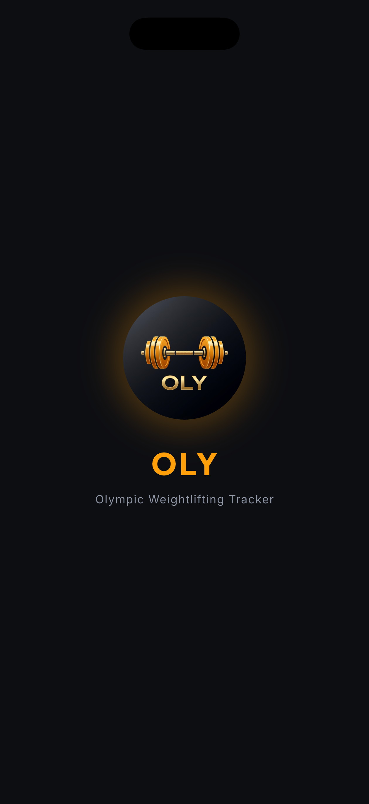
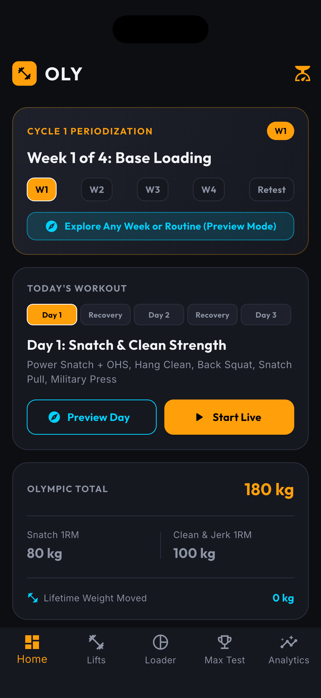
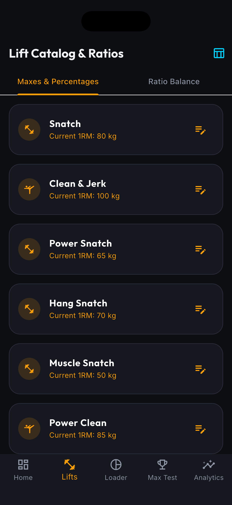
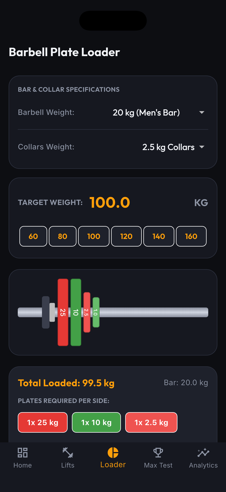
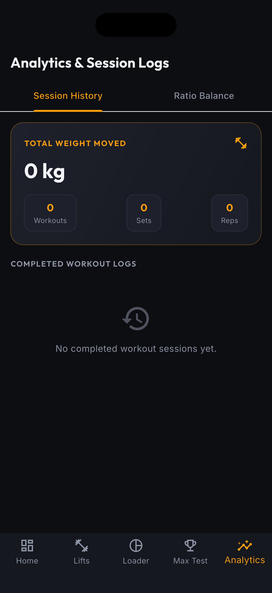

# OLY — Olympic Weightlifting & Periodization Tracker

<p align="center">
  
</p>

<p align="center">
  <b>A modern, dark-mode Flutter application designed for Olympic weightlifting athletes, coaches, and strength enthusiasts.</b>
</p>

---

## 🌟 Overview

**OLY** is built specifically for Snatch, Clean & Jerk, and Squat strength progression. It combines dynamic periodization programming (`@ 65-70-75-70%`), interactive barbell bumper plate calculation, variation lift 1RM suggestions, guided warm-up routines, lifetime tonnage analytics, and a Week 5 1RM Retest protocol into a sleek, high-contrast dark interface.

---

## 🚀 Key Features

### 🏋️‍♂️ 5-Step Periodized Program Sequence
- **Structured Days**: `Day 1 (Heavy Snatch/Squat) → Active Recovery → Day 2 (Muscle Snatch/Block Clean) → Active Recovery → Day 3 (Hang Snatch/C&J/Front Squat)`.
- **Dynamic Load Percentages**: Automatically calculates working set target weights based on cycle week:
  - **Week 1**: Base Loading (65%)
  - **Week 2**: Loading (70%)
  - **Week 3**: Peak Loading (75%)
  - **Week 4**: Deload & Prep (70%)
  - **Week 5**: **1RM Retest Protocol**
- **Automatic Week Rollover**: Completing Day 5 advances progress to `Week + 1, Day 1`.
- **Manual Overrides**: Tap-to-override day and week selector pills directly on the Dashboard.

### 🧭 Routine Explorer & Preview Mode
- Preview and practice any workout routine for any week without modifying your active cycle history or polluting analytics.

### ⚖️ Visual IWF Barbell Bumper Plate Loader
- Real-time rendering of IWF color-coded bumper plates:
  - 🔴 **25 kg / 45 lb** (Red)
  - 🔵 **20 kg / 35 lb** (Blue)
  - 🟡 **15 kg / 25 lb** (Yellow)
  - 🟢 **10 kg / 10 lb** (Green)
  - ⚪ **5 kg** (White Bumper)
  - ⚪ **Fractionals**: 2.5kg, 2kg, 1.5kg, 1kg, 0.5kg
- Customizable barbell weights (20kg Men's, 15kg Women's, 10kg Technique, 45lb Standard) and collar weights.

### 💡 Smart 1RM Variation Ratios & Reference Chart
- Built-in Olympic variation ratios based on Greg Everett / Catalyst Athletics benchmarks:
  - **Hang Snatch**: 88% of Snatch
  - **Power Snatch**: 82% of Snatch
  - **Front Squat**: 85% of Back Squat
  - **Hang Clean**: 88% of C&J
  - **Block Clean**: 90% of C&J
- **Auto 1RM Suggestions**: Smart suggestion chips auto-calculate target 1RMs with one-tap fill.
- **Olympic Ratio Standards Reference Chart**: Interactive sheet displaying full variation benchmarks and ideal 1RM targets.

### 📈 Lifetime Tonnage & Weight Moved Analytics
- Calculates total volume (`weight * reps`) for every set, exercise, and workout session.
- Displays total lifetime weight moved in **Metric Tonnes** or **US Short Tons**, total sessions, sets, and reps.

### 🧘‍♂️ Guided 5-Step Warm-Up Companion
- Interactive modal sheet with cardio timer, thoracic foam rolling pass counter, joint DROMs checkboxes, static stretch holds, and barbell technique prep.

---

## 📱 App Screenshots

| Splash Screen | Home Dashboard |
| :---: | :---: |
|  |  |

| Lift Catalog & Maxes | Barbell Plate Loader |
| :---: | :---: |
|  |  |

| Total Weight Moved Analytics |
| :---: |
|  |

---

## 🛠️ Architecture & Technologies

- **Core Framework**: [Flutter](https://flutter.dev) (Dart 3.x)
- **State Management**: `Provider`
- **UI Design System**: Dark Obsidian & Neon Amber (`AppTheme`), `GoogleFonts` (Outfit & Inter)
- **Persistence**: `SharedPreferences` via `StorageService`
- **Native Launcher & Splash**: `flutter_launcher_icons` & `flutter_native_splash`

---

## 💻 Getting Started

### Prerequisites
- Flutter SDK (v3.13.0 or higher)
- Xcode (for iOS builds) / Android Studio (for Android builds)

### Installation & Run

1. **Clone the repository**:
   ```bash
   git clone https://github.com/drexel-ue/oly.git
   cd oly
   ```

2. **Install dependencies**:
   ```bash
   flutter pub get
   ```

3. **Run unit tests**:
   ```bash
   flutter test
   ```

4. **Launch on connected device or simulator**:
   ```bash
   flutter run
   ```

---

## 📝 License

Designed and developed for Olympic weightlifting athletes.
