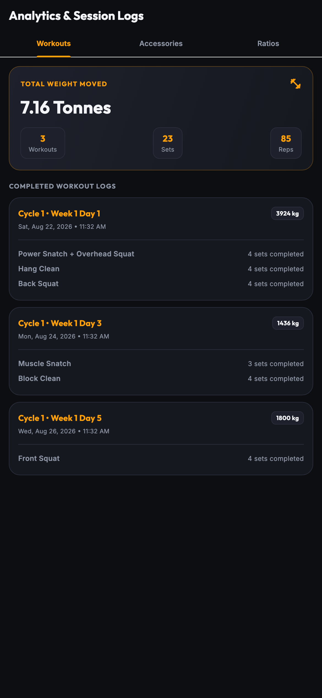
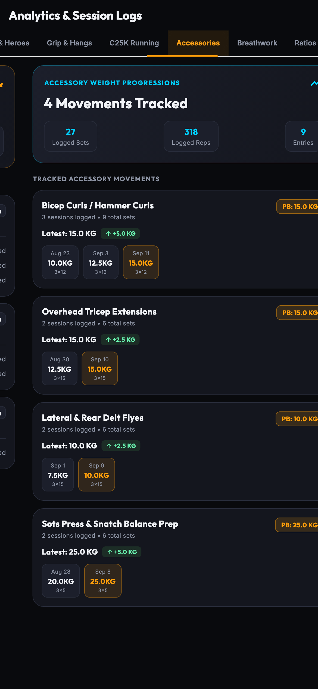
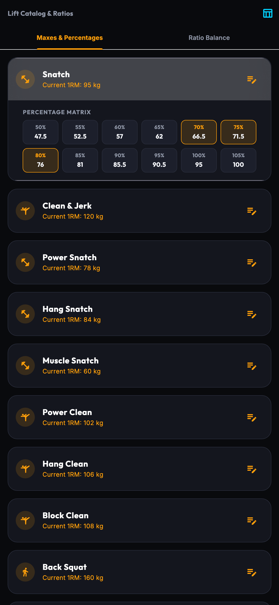
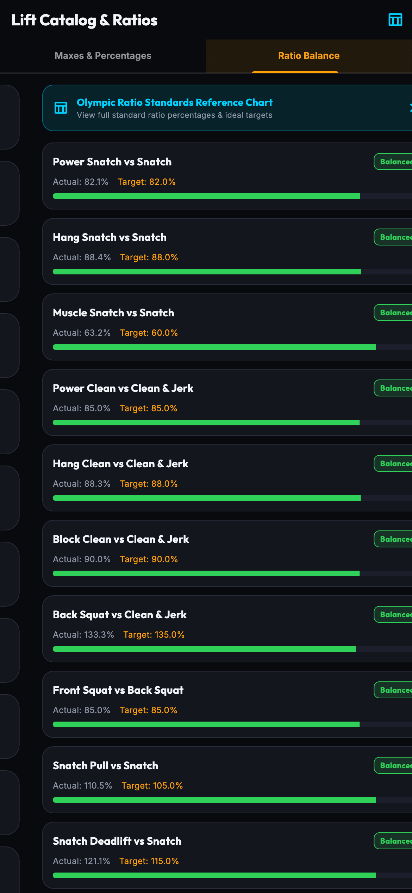
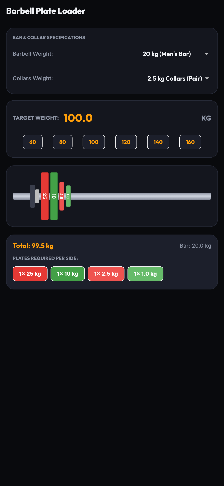
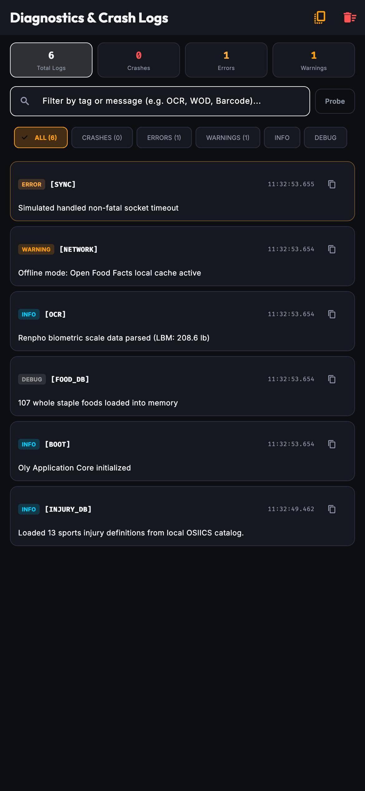

# OLY — Olympic Weightlifting, Periodization & Metabolic Nutrition Tracker

<p align="center">
  
</p>

<p align="center">
  <b>A comprehensive, high-contrast Flutter application engineered for Olympic weightlifters, strength athletes, and coaches — integrating periodization programming, real-time TUT workout tracking, metabolic energy balance, continuous barcode scanning, and on-device biometric scale OCR.</b>
</p>

<p align="center">
  
  
  
  
  
  
  
</p>

---

## 🌟 Overview

**OLY** unites elite Olympic weightlifting periodization with a rigorous athlete nutrition engine, metabolic expenditure modeling, and an offline-first **Anatomical Body Map & Biomechanical Injury Adaptation Engine**. Designed from the ground up for serious athletes:

- **🏋️ Periodization & Lifts**: 4-Day and 5-Day wave loading programs (`65% → 70% → 75% → Deload → Retest`), Catalyst Athletics / Greg Everett 1RM variation ratios, dynamic in-workout exercise swapping, working weight adjustments with live 1RM recalculation, and an IWF color-coded bumper plate visualizer.
- **🩺 Body Map & Injury Adaptation**: Interactive 14-region Front & Back vector anatomical body map, OSIICS-16 local sports medicine taxonomy, duration-based **Acute ($< 14$d)** vs. **Subacute ($14-42$d)** vs. **Chronic ($> 42$d)** stage tracking, pre-session 1-tap biomechanical movement regressions, and post-session before-vs-after strain check-ins.
- **🥗 Nutrition & Metabolic Engine**: Dual Energy In / Energy Out balance gauge, Katch-McArdle LBM-based BMR calculation, Compendium of Physical Activities (Algorithm B net vs Algorithm A gross expenditure), automated WOD TUT physics calories sync, and dynamic daily hydration tracking.
- **📷 Smart Barcode Scanner & Open Food Facts**: Live camera viewfinder with golden animated targeting reticle, continuous scanning with haptic feedback, typed Open Food Facts SDK integration with offline caching, force-refresh, and a 107+ staple whole foods database.
- **🥞 Athlete Smart Portion Drawer**: Protein density metrics ($g \text{ protein} / 100\text{ kcal}$), 3-color macro split bar ($P\% / C\% / F\%$), standard serving vs. custom gram steppers, and daily macro goal comparison badges.
- **⚖️ Renpho Smart Scale OCR**: On-device text recognition extracting 13 biometric indicators directly from smart scale screenshots, visualized through an interactive Lean Mass vs. Fat Mass donut chart.
- **🛡️ Local Diagnostics & Crash Reporting**: Real-time in-memory ring buffer (250 logs), persistent crash log storage (50 crashes), global error interceptors, and an in-app diagnostics inspector with copy-all reporting.

---

## 📱 Visual Feature Tour

### 🥗 Nutrition & Metabolic Energy Balance

| Nutrition Dashboard (Top) | Nutrition Dashboard (Scrolled) |
| :---: | :---: |
|  |  |
| *Energy In vs Out gauge, net deficit/surplus, and Renpho body composition glance* | *Daily meal logs, Compendium activities & WOD energy, and quick hydration tracker* |

| Metabolic Science Explainer (Top) | Metabolic Science Explainer (Scrolled) |
| :---: | :---: |
|  |  |
| *Interactive 5-tab science reference: Energy & TDEE, Algorithm B vs A, and WOD physics* | *Katch-McArdle formula breakdown, MET math, and open-source scientific citations* |

---

### 📷 Live Barcode Scanner & Athlete Portion Drawer

| Live Camera Barcode Scanner | Athlete Smart Portion Drawer |
| :---: | :---: |
|  |  |
| *Continuous camera stream with golden reticle overlay, torch toggle, and recent scans ribbon* | *Protein density index, 3-color macro split bar, serving/gram steppers, and goal badges* |

| Food Search & Recent Pantry Items | Renpho Body Composition OCR Scanner |
| :---: | :---: |
|  |  |
| *Instant search across 107+ staple foods, offline cached products, and recent scans* | *13-field OCR parser from screenshot with Lean Mass vs Fat Mass donut visualizer* |

---

### 🏋️ Periodization & Live Workout Tracking

| Home Dashboard (Top) | Home Dashboard (Scrolled) |
| :---: | :---: |
|  |  |
| *Active cycle week, next prescribed workout, and one-tap recovery launcher* | *Current cycle calendar, weekly workout timeline, and recent session summaries* |

| Live Workout Session (Top) | Live Workout Session (Scrolled) |
| :---: | :---: |
|  |  |
| *Periodized target weight banner, warm-up trigger, and interactive set checklist* | *Accessory movements, live rest timer bar, and session notes* |

| Movement Variation Swaps | Weight Adjustment & 1RM Recalculator |
| :---: | :---: |
|  |  |
| *Segmented Suggested Swaps vs Other Movements with live target weights* | *Tune working weight and auto-recalculate baseline 1RM with delta audit notes* |

---

### 🧘‍♂️ Active Recovery, Analytics & Diagnostics

| Interactive Anatomical Body Map | Clinical PDF & JSON Export |
| :---: | :---: |
|  |  |
| *14-region clickable body map, acute (<14d) vs chronic (6w+) tags, and OSIICS catalog* | *Multi-page clinical PDF report and structured raw JSON data backup* |

| Post-Session Strain Check-In | Active Recovery Routine |
| :---: | :---: |
|  |  |
| *Before-vs-after session strain comparison modal and recovery sync* | *Adaptive 5-phase mobility flow generated from previous joint strain tags* |

| Guided Olympic Warm-Up | Mobility & Drill Swaps |
| :---: | :---: |
|  |  |
| *Multi-phase warm-up drills with video guides, form cues, and rep counters* | *Segmented alternatives matching target joint focus area or category* |

| Lifetime Volume Analytics | Accessory Weight Progressions |
| :---: | :---: |
|  |  |
| *Total tonnage moved, completed workouts, sets, and reps in tonnes or tons* | *Tracked movements, personal bests, and chronological delta gain chips* |

| Lift Catalog & Percentages | Olympic Ratio Balance |
| :---: | :---: |
|  |  |
| *1RM baselines with expanded 50%–105% percentage matrix* | *Catalyst Athletics benchmark targets & diagnostic balance analysis* |

| Barbell Plate Loader | System Diagnostics & Crash Logs |
| :---: | :---: |
|  |  |
| *IWF color-coded bumper plates and per-side loading breakdown* | *Real-time log buffer, persistent crash records, and copy-all diagnostic reports* |

---

## 🚀 Comprehensive Feature Breakdown

### 🥗 1. Athlete Nutrition & Metabolic Expenditure Engine
- **Dual Energy In / Energy Out Balance Gauge**: Visual circular gauge displaying calories consumed vs. total daily energy expenditure (TDEE).
- **Net Caloric Deficit / Surplus Indicator**: Live status pill dynamically color-coded based on nutrition goals (Green for deficit, Amber for maintenance, Cyan for surplus).
- **Katch-McArdle LBM Formula**: Prioritizes Lean Body Mass (derived from Renpho scale scans) for BMR:
  $$\text{BMR} = 370 + (21.6 \times \text{Lean Mass in kg})$$
  *(Fallback to Mifflin-St Jeor and Harris-Benedict when body fat % is unavailable).*
- **2024 Compendium of Physical Activities Integration**: Calculates active energy expenditure using validated MET values:
  - **Algorithm B (Net Active Expenditure)**: $\text{Active kcal} = (\text{MET} - 1.0) \times \text{BMR}_{\text{per\_min}} \times \text{Duration}$ (prevents double-counting resting metabolic rate).
  - **Algorithm A (Gross Expenditure)**: $\text{Gross kcal} = \text{MET} \times \text{BMR}_{\text{per\_min}} \times \text{Duration}$.
- **Automated WOD TUT Physics Energy Sync**: Completed Olympic weightlifting sessions automatically compute time-under-tension (TUT) and total barbell tonnage to calculate precise workout calorie burn directly into the daily log.
- **Daily Hydration Tracker**: One-tap quick-add buttons (+8 oz, +16 oz, +24 oz, +32 oz) with progress bar toward customized daily water intake targets.

### 📷 2. Live Barcode Scanner & Open Food Facts SDK
- **Continuous Live Camera Viewfinder**: Built on `mobile_scanner` 7.x with real-time barcode decoding (UPC-A, EAN-13, EAN-8, Code 128).
- **Animated Golden Reticle Overlay**: Floating gold viewport with animated laser scanning line, torch/flashlight toggle, and camera flip controls.
- **Official Open Food Facts Dart SDK (`openfoodfacts: ^3.30.2`)**: Queries typed v3 API endpoints with custom `User-Agent` headers.
- **Local Offline Product Caching**: Automatically persists scanned products to local storage for instantaneous loading in gym basements without cellular service, complete with a "Force Refresh from Server" action.
- **Curated Whole Staple Food Database**: Embedded offline database with 107+ whole staple foods (chicken breast, white rice, eggs, whey isolate, Greek yogurt, oats, sweet potatoes, etc.).

### 🥞 3. Athlete Smart Portion & Macro Drawer
- **Protein Density Index**: Calculates grams of protein per 100 kcal with color-coded density pills:
  - 🟢 **Ultra-High Density** ($\ge 15\text{g} / 100\text{ kcal}$)
  - 🟡 **Moderate Density** ($8\text{g}–15\text{g} / 100\text{ kcal}$)
  - ⚪ **Standard Density** ($< 8\text{g} / 100\text{ kcal}$)
- **Dynamic 3-Color Macro Split Bar**: Real-time visual proportional split ($P\% / C\% / F\%$).
- **Dual-Mode Portion Adjuster**:
  - Standard serving count stepper (1, 1.5, 2 servings).
  - Exact gram entry with quick-step chips (`+10g`, `+50g`, `+100g`).
- **Goal Impact Badges**: Live calculation of how the portion fulfills your daily macro targets (e.g. `24% of Daily Protein`).

### ⚖️ 4. Renpho Smart Scale OCR Scanner & Donut Visualizer
- **On-Device Biometric Recognition**: Extracts 13 biometric metrics directly from smart scale screenshots using Google ML Kit Vision:
  - Weight, Body Fat %, Skeletal Muscle %, Muscle Mass, Fat-Free Body Weight, Subcutaneous Fat, Visceral Fat, Body Water, Bone Mass, BMR, Protein %, Metabolic Age, and BMI.
- **Body Composition Donut Chart**: Custom-rendered segmented donut chart breaking down Lean Mass, Fat Mass, and Residual Mass.
- **Automated Target Recalibration**: Automatically updates athlete BMR and baseline maintenance calories based on scanned lean mass.

### 🔬 5. Metabolic Science Explainer Hub
- **Interactive 5-Tab In-App Science Hub**:
  1. **⚡ Energy & TDEE**: Explains Basal Metabolic Rate, NEAT, TEF, and exercise activity thermogenesis.
  2. **⚖️ Algorithm B vs A**: Comprehensive breakdown of net vs. gross MET expenditure calculations.
  3. **🏋️ WOD TUT Physics**: Details set-level time-under-tension and mechanical work formulas.
  4. **💧 Hydration Models**: Hydration guidelines calibrated for high-intensity strength athletes.
  5. **📚 Open Source & Sources**: Complete academic citations (Ainsworth et al. 2024 Compendium, Katch & McArdle 1996, Open Food Facts database).

### 🛡️ 6. Local Logging, Global Crash Interception & Diagnostics
- **Real-Time In-Memory Ring Buffer**: Captures the last 250 log events with log levels (`DEBUG`, `INFO`, `WARNING`, `ERROR`, `CRASH`).
- **Persistent Crash Storage**: Automatically saves the last 50 fatal and unhandled exceptions to local disk with full stack traces.
- **Global Error Interceptors**: Intercepts `FlutterError.onError` and `PlatformDispatcher.instance.onError`.
- **In-App Diagnostics Screen**: Filter logs by level, live search, expand stack traces, trigger test crashes, and generate formatted diagnostic reports for clipboard export.

### 🏋️‍♂️ 7. Structured Periodization Engine (4-Day & 5-Day)
- **Periodized Wave Loading**: Automatically calculates target weights for every working set based on your 1RMs and current cycle week:
  - **Week 1 (Base Loading)**: ~65% target intensity
  - **Week 2 (Loading)**: ~70% target intensity
  - **Week 3 (Peak Loading)**: ~75% target intensity
  - **Week 4 (Deload & Priming)**: ~70% reduced volume
  - **Week 5 (1RM Retest)**: Dedicated testing protocol with guided warmup ramps
- **Program Flexibility**: Toggle between **4-Day Strength & Technique** and **5-Day Classical Sequence** in Settings.
- **Preview & Exploration Mode**: Explore and review any past or future week/routine without modifying active cycle state.

### ⏱️ 8. Live Workout Session Companion & In-Workout Swaps
- **Set & Rep Tracking**: Interactive set completion pills with real-time weight overrides and rep adjustments.
- **Suggested Swaps Segmentation**: Automatically identifies direct variations within the same movement pattern family (e.g., Power Snatch, Hang Snatch for Snatch variations) and displays them at the top of the swap sheet.
- **In-Workout Weight Adjustment & 1RM Recalculator**: Real-time reverse 1RM calculation with quick steppers (`-5.0` to `+5.0`) and delta comparison badges.
- **Intelligent Rest Timer**: 30s to 5m presets with micro-adjusters, audio beeps, haptics, and iOS lock-screen local notifications.

### 🧘‍♂️ 9. Adaptive Active Recovery & Mobility Engine
- **Targeted Routine Generation**: 12 structured drills across 5 dedicated phases (Aerobic, Joint Mobility, Arms Hypertrophy, Core Stability, Grip Strength).
- **Strain Adaptation**: Automatically prioritizes mobility drills targeting joints flagged during previous workout logs (Shoulders, Knees, Wrists, Lower Back).

### 💡 10. Catalyst Athletics Olympic 1RM Variation Ratios
- **Automated Ratio Calculations**: Built-in benchmark targets derived from Greg Everett Olympic standards (Hang Snatch 88%, Power Snatch 82%, Overhead Squat 110%, Hang Clean 88%, Power Clean 85%, Front Squat 85%, Push Press 75%).
- **Ratio Balance Diagnostic**: Identifies whether technique, pulling power, or leg strength is your limiting factor.

### 🔴 11. Visual IWF Barbell Bumper Plate Loader
- **Realistic Barbell Rendering**: Visually renders standard IWF colored bumper plates (Red 25kg, Blue 20kg, Yellow 15kg, Green 10kg, White 5kg, and fractionals 0.5kg–2.5kg).
- **Customizable Equipment**: Switch between Men's 20kg bar, Women's 15kg bar, 10kg Technique bar, 45lb bar, and competition collar options.

### 📈 12. Volume Analytics & Accessory Weight Progressions
- **Total Workload Calculation**: Multiplies `weight × reps` across all completed sets in **Metric Tonnes** ($1{,}000\text{ kg}$) or **US Short Tons** ($2{,}000\text{ lbs}$).
- **Accessory Progressions**: Tracks all accessory personal bests and logs with chronological delta chips (`+2.5 kg`, `+5.0 kg`).
- **Native Backup & Export**: One-tap JSON backup/restore and human-readable CSV spreadsheet export.

---

## 📸 Automated Screenshot Verification Pipeline

OLY includes an automated screenshot capture suite supporting both top and scrolled viewports:

```bash
# Run automated screenshot generation test (captures all 25 high-res PNG images)
flutter test test/screenshot_capture_test.dart
```

Generated screenshots are saved directly to `screenshots/` and verified across 21 multi-screen rendering tests.

---

## 🛠️ Architecture & Tech Stack

```
lib/
├── main.dart                                  # Application root, error interceptors & provider setup
├── theme/
│   └── app_theme.dart                         # Dark Obsidian (#121214) & Neon Amber (#FF9E1B) design system
├── models/
│   ├── lift_model.dart                        # Lift definitions & Olympic variation ratio math
│   ├── program_model.dart                     # 4-Day & 5-Day periodization templates & week loaders
│   ├── workout_session.dart                   # Workout session logs, RPE, and strain models
│   ├── mobility_exercise_model.dart           # Active recovery exercises with cues & video links
│   ├── nutrition_entry.dart                   # Daily food logs, activities, and macro models
│   ├── body_comp_model.dart                   # 13-field Renpho scale biometrics & historical trends
│   └── plate_calc.dart                        # Barbell sleeve greedy plate allocation algorithm
├── providers/
│   ├── lift_provider.dart                     # 1RM catalog & ratio balance calculations
│   ├── program_provider.dart                  # Periodization cycle progression & week advancement
│   ├── recovery_provider.dart                 # Recovery routine generation & readiness tracking
│   ├── nutrition_provider.dart                # Calorie balance, macro tracking, & hydration
│   ├── body_comp_provider.dart                # Renpho scale history & lean mass calculations
│   └── settings_provider.dart                 # Units (kg/lbs), bar specs, audio/haptic toggles
├── services/
│   ├── storage_service.dart                   # Local persistence, JSON/CSV backup & product caching
│   ├── food_database_service.dart             # Open Food Facts SDK integration & staple food database
│   ├── renpho_ocr_service.dart                # Google ML Kit OCR text parser for smart scale screens
│   ├── app_log_service.dart                   # Ring-buffer logging & persistent crash storage
│   ├── notification_service.dart              # Timezone-aware local notifications & audio alerts
│   ├── recovery_engine_service.dart           # Adaptive mobility routine generator
│   └── warmup_engine_service.dart             # Dynamic warmup generator
├── views/
│   ├── splash_screen.dart                     # Animated launch splash
│   ├── dashboard_screen.dart                  # Main hub with cycle status & workout launchers
│   ├── workout_session_screen.dart            # Live workout tracking, rest timer, weight adjust & swap
│   ├── recovery_session_screen.dart           # Interactive 5-phase mobility routine
│   ├── warmup_session_screen.dart             # Guided warm-up sequence with video drills
│   ├── lifts_screen.dart                      # 1RM catalog & Olympic variation standards
│   ├── plate_calculator_screen.dart           # Barbell plate visualizer & specs
│   ├── max_test_screen.dart                   # Week 5 1RM retest protocol
│   ├── analytics_screen.dart                  # Total tonnage, workout history, & ratio charts
│   ├── nutrition/
│   │   ├── nutrition_dashboard_screen.dart    # Energy In vs Out gauge, macros, and activity logs
│   │   ├── live_barcode_scanner_sheet.dart    # Live camera barcode scanner with reticle overlay
│   │   ├── food_search_sheet.dart             # Search staple foods, cached items, & recent scans
│   │   ├── renpho_scanner_sheet.dart          # Smart scale OCR scanner & donut chart view
│   │   ├── activity_log_sheet.dart            # Compendium activity logger with Algorithm B
│   │   └── metabolic_science_explainer_screen.dart # 5-tab metabolic science reference hub
│   └── diagnostics/
│       └── crash_report_screen.dart           # In-app log inspector, error filter, & diagnostic export
└── widgets/
    ├── barbell_visualizer.dart                # CustomPainted IWF bumper plate rendering
    ├── exercise_swap_modal.dart               # Segmented exercise swap modal (Suggested vs Other)
    ├── workout_weight_dialog.dart             # Working weight adjust & 1RM recalculator dialog
    ├── rest_timer_widget.dart                 # Timer dial, micro-steppers, and alert dispatcher
    ├── video_player_card.dart                 # YouTube thumbnail preview & coaching link launcher
    ├── standard_ratios_sheet.dart             # Catalyst Athletics ratio benchmarks table
    └── nutrition/
        ├── energy_balance_card.dart           # Circular Energy In/Out gauge & deficit indicator
        ├── smart_portion_drawer.dart          # Protein density pill, macro split bar & steppers
        ├── macro_summary_card.dart            # Linear progress bars for Protein, Carbs, and Fat
        └── body_donut_chart.dart              # CustomPainted Lean Mass vs Fat Mass donut visualizer
```

---

## 💻 Getting Started

### Prerequisites
- **Flutter SDK**: `^3.13.0` or later
- **Dart SDK**: `^3.0.0` or later
- **Xcode**: 15+ (for iOS development & testing)
- **CocoaPods**: Latest

### Installation & Run

1. **Clone the repository**:
   ```bash
   git clone https://github.com/drexel-ue/oly.git
   cd oly
   ```

2. **Install Flutter dependencies**:
   ```bash
   flutter pub get
   ```

3. **Run code analysis & automated test suite**:
   ```bash
   flutter analyze
   flutter test
   ```

4. **Launch on connected device or simulator**:
   ```bash
   # Launch on iOS Simulator
   flutter run -d iPhone

   # Launch directly to a specific tab (0=Home, 1=Lifts, 2=Loader, 3=MaxTest, 4=Analytics, 5=Nutrition)
   flutter run --dart-define=TAB=5
   ```

---

## 📄 Testing Suite (139 Passing Tests)

Run the full suite of unit, widget, domain engine, and screenshot rendering tests:
```bash
flutter test
```

Test coverage includes:
- `injury_export_test.dart`: Clinical PDF document byte generation, structured JSON backup format, and export bottom sheet widget interactions.
- `injury_model_test.dart`: OSIICS serialization, duration calculation, and acute/subacute/chronic classification.
- `injury_adaptation_test.dart`: Biomechanical loading vector rules, exercise regressions, and rehab warmup injection.
- `injury_provider_test.dart`: Injury CRUD, persistent storage, history tracking, and post-session diff sync.
- `injury_tracker_widget_test.dart`: Interactive body map front/back toggle, tap detection, adaptation card 1-tap swap, and check-in dialog.
- `energy_balance_test.dart`: Katch-McArdle, Mifflin-St Jeor, Compendium MET calculations (Algorithm B vs A), and WOD TUT physics.
- `energy_balance_widget_test.dart`: `EnergyBalanceCard` gauge, `MetabolicScienceExplainerScreen` 5 tabs, and `ActivityLogSheet`.
- `food_database_service_test.dart`: Open Food Facts SDK query, typed parsing, offline caching, and 107+ whole foods lookup.
- `smart_portion_widget_test.dart`: Protein density index, macro split bar, custom gram steppers, and live barcode camera scanner.
- `renpho_ocr_test.dart`: 13-field OCR regex parsing from smart scale screenshots, lean mass calculations, and BMR updates.
- `app_log_service_test.dart`: Ring-buffer logging, persistent crash storage, and `CrashReportScreen` UI controls.
- `screenshot_capture_test.dart`: 23 multi-view layout tests verifying rendering and generating high-res PNGs for all views.
- `exercise_swap_test.dart`: Movement substitution, variation categorization, and weight recalculation.
- `workout_weight_recalculation_test.dart`: In-workout weight adjustment, 1RM reverse formulas, steppers, and save modes.
- `feature_audit_test.dart`: Session serialization, RPE, joint strain tags, recovery adaptation, and JSON/CSV backup.
- `plate_calculator_test.dart`: Greedy plate allocation algorithm across kg/lb configurations.
- `percentage_calculator_test.dart`: Working weight calculation and rounding rules across periodization weeks.
- `recovery_engine_test.dart`: Adaptive mobility exercise selection and strain focus algorithms.

---

## 📝 License

Developed for Olympic weightlifters, coaches, and strength athletes.  
Copyright © 2026 Lamont Labs. All rights reserved.
